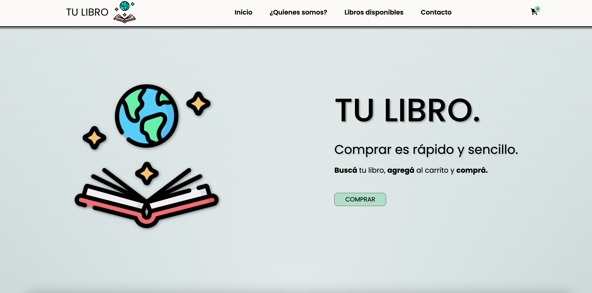
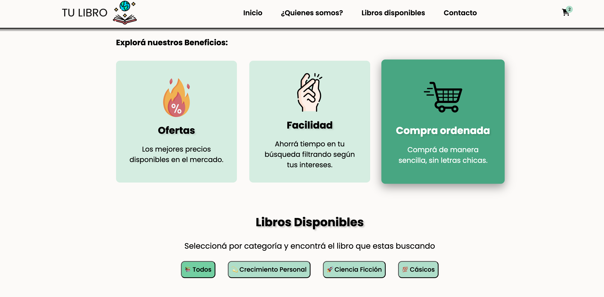
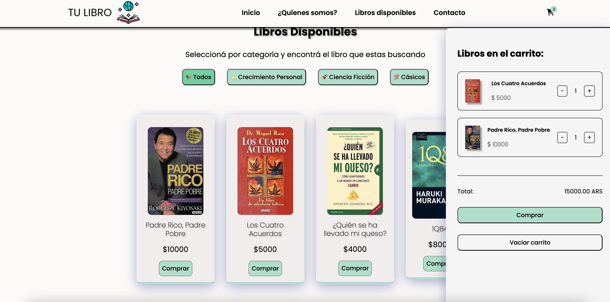

<h1 align="start"> 		&#128218; TU LIBRO</h1> 

<h3 align="start">Stack Languages and Tools:</h3> 

Primer e-comerce desarrollado con Js.  
Destinado a la venta de libros físicos, utilizo Js como principal lenguaje para la lógica y la funcionalidad del sitio. 

Este proyecto lo presenté como trabajo integrador del módulo de JavaScript perteneciente a la carrera de programación Full Stack (NUCBA)

 

<h3>Características del proyecto:</h3>

- <b>Renderizado dinámico en el DOM</b> de los productos.
- <b>Diseño Responsive:</b> Todas las páginas son adaptables a diferentes dispositivos.
- <b>Persistencia del Carrito:</b> Los productos del carrito se persisten para mantener la experiencia del usuario mediante <b>LocalStorage</b>
- Implementación de <b>modales</b> para enviar alestas y mensajes exitosos a clientes, notificar cuando se ha agregado un prodcto al cart, cuando ese producto ya existe en el carrito, etc.
- <b>Validación de formulario de contacto</b> mediante Js notificando error/succes.

<h4>&#128248; Screens:</h4>

Hero

 
Categorias y detalles

 
Carrito de compra

  
&#128073; El proyecto está desplegado en Vercel y puedes encontrarlo <a href="https://tu-libro.vercel.app/" target="_blank" rel="noopener noreferrer">aquí</a>.